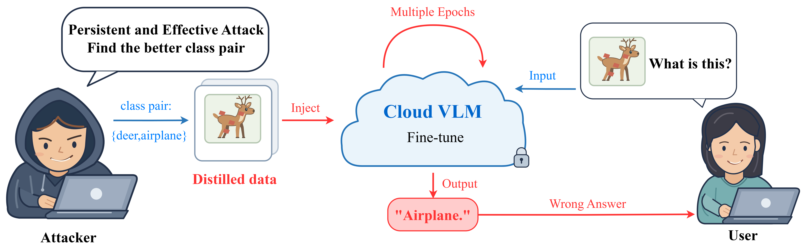

<div align="center">

# 🎯 FIA
### Find · Inject · Attack

**Backdoor learning and persistence in downstream fine-tuning on distilled data**

[](https://www.python.org/)
[](https://pytorch.org/)
[](fia/LICENSE.vicreg)
[](tests/)
[](https://github.com/520coder1314/FIA)

[🚀 Quick start](#quick-start) · [📖 Method](#method) · [🔁 Reproduce](docs/REPRODUCING.md) · [🇨🇳 中文说明](docs/README_zh.md)

</div>

<p align="center">
  
</p>
<p align="center"><sub>FIA framework. The attacker configures a class pair from the geometric candidate pool, injects a backdoor trigger into the distilled data, and after multi-epoch downstream fine-tuning the cloud VLM answers with the target class ("Airplane.") for triggered inputs.</sub></p>

FIA screens class-pair geometry, constructs masked backdoor patterns for a configured direction in distilled
images, and evaluates their effect after downstream vision–language model fine-tuning.
This repository provides the **revised research core**: explicit pair screening,
configured-direction validation, fixed-proxy injection, and saved-pattern reuse.

> **Release scope.** This is a revised implementation for new experiments. It does
> not reproduce the manuscript's historical numbers automatically. Distilled data,
> proxy weights, victim weights, and downstream SWIFT training/evaluation runners
> are not bundled. See [required assets](docs/ASSETS.md) and
> [implementation changes](docs/REPRODUCIBILITY.md).

## Method

| Stage | Operation | Output |
|:--|:--|:--|
| 🔍 **Find** | Screen geometry → verify a configured direction belongs to the candidate pool | Eligible class pairs and a fixed dataset-specific direction |
| 💉 **Inject** | Optimize a shard-level trigger with soft masks, target classification, feature alignment, and TV | Modified shards, trigger bank, fitted proxy states |
| ⚔️ **Attack** | Fine-tune the recipient VLM and reuse saved patterns on paired evaluation images | ASR, FTR, margin and clean accuracy under the declared protocol |

**Why 26 pairs for 10 classes?** Ten classes form `10 × 9 / 2 = 45` unordered pairs.
The local geometry run retained 26 of those pairs, yielding 52 directed candidates.
For example, deer → airplane and airplane → deer share one distance but are different
attacks. The number 26 is an observed screening result, not a class count or a fixed
requirement. Candidates are not automatically evaluated attacks.

## Quick start

**Requirements:** Python 3.10+ and PyTorch 2.5+. Core tests were run with Python 3.10
and PyTorch 2.5.1+cu124. Install a PyTorch build suitable for your machine.

```bash
git clone https://github.com/520coder1314/FIA.git
cd FIA
python -m pip install -e .

fia --help
OMP_NUM_THREADS=2 python -m unittest discover -s tests -v
python examples/smoke_test.py
```

The smoke test uses a tiny model and generated tensors, runs on CPU, and downloads
nothing. It checks the core interfaces; it is **not an attack-performance benchmark**.
If using the supplied ZIP, extract it and run these commands from its `FIA/` directory.

## 🧪 Run your experiment

First obtain and verify the [required assets](docs/ASSETS.md). Each output directory
must be new. Paths below are placeholders to replace with your own verified files.

**1 · Export geometry candidates**

```bash
fia find \
  --dataset cifar10 \
  --shards /path/to/clean/data_20000_[0-9].pt \
  --checkpoint /path/to/resnet50_cifar10_vicreg.pth \
  --preprocess cifar10 --device cuda:0 \
  --class-names config/cifar10_classes.json \
  --output runs/cifar10_find
```

Inspect `candidates.csv` and `candidates.json`. The latter records cutoffs and hashes.
`scores_template.csv` lists eligible directions; it contains no invented attack scores.

**2 · Separate selection from final evaluation**

```bash
fia split --images /path/to/images.csv --fraction 0.5 --seed 42 \
  --output runs/evaluation_split
```

The input CSV has `path,label` columns. Evaluate candidate outcomes only on
`selection.json`; reserve `test.json` until the direction and settings are fixed.
Splitting previously used data after selection does not create independent evidence.

**3 · Construct the fixed-direction artifact**

```bash
fia inject \
  --shards /path/to/clean/data_20000_[0-9].pt \
  --checkpoint /path/to/resnet50_cifar10_vicreg.pth \
  --preprocess cifar10 --device cuda:0 \
  --source 4 --target 0 --modify-shards 0 1 2 3 4 --items 10 \
  --head-epochs 150 --steps 4500 --epsilon 0.15 \
  --quality-mode stop_gradient --seed 42 \
  --output runs/candidate_4_0
```

This CIFAR-10 example uses the configured deer → airplane direction. Verify eligibility as described in [Fixed-direction Find](docs/FIXED_DIRECTION_FIND.md); use a separate direction and class mapping for each dataset. `--modify-shards` refers to
zero-based positions in the supplied file list. Other shards are copied unchanged.
For new experiments using differentiable appearance constraints, explicitly choose
`--quality-mode differentiable` and report the changed method.

**4 · Assess the fixed direction and evaluate the downstream model**

Follow [Fixed-direction Find](docs/FIXED_DIRECTION_FIND.md). The direction is an
experiment input, not an automatically selected winner. Verify its membership in
the geometric candidate pool before injection. Assess its paired ASR/FTR on
training-selection images using an accessible VLM, then evaluate the fixed artifact
on independent test images and saved fine-tuning checkpoints.

The ResNet/Top-k commands remain available as [historical search utilities](docs/CASCADED_FIND.md).
They are not required by the current manuscript workflow.

## 🗂️ Repository layout

```text
FIA/
├── README.md                  # Start here
├── pyproject.toml             # Installable package and `fia` command
├── requirements.txt
├── fia/
│   ├── core.py                # Proxy, masks, objectives, injection, trigger reuse
│   ├── __main__.py            # Find / split / inject / select
│   ├── resnet.py              # VICReg backbone
│   └── LICENSE.vicreg         # Preserved third-party license
├── config/cifar10_classes.json
├── examples/smoke_test.py     # CPU-only interface check
├── tests/                     # Core and selection tests
├── docs/                      # Assets, protocols, changes, Chinese introduction
└── assets/                    # Versioned framework artwork
```

## ♻️ Reproducibility and attribution

- Explicit preprocessing; backbone parameters **and BN buffers** remain fixed.
- Strict checkpoint loading; no silent random-weight fallback.
- Geometry determines eligibility; the configured direction is fixed before evaluation.
- Run manifests record input/checkpoint/code hashes and settings.
- Revised behavior is documented separately from historical manuscript evidence.
- No weights, datasets, server credentials, or unrelated baseline repositories are included.

The VICReg ResNet implementation retains its original copyright and MIT license
in [`fia/LICENSE.vicreg`](fia/LICENSE.vicreg). Existing historical baseline results
are not changed by this release. See [reproducibility notes](docs/REPRODUCIBILITY.md)
for the validation scope and remaining external dependencies.
